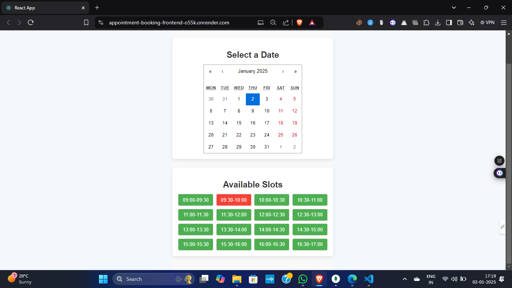
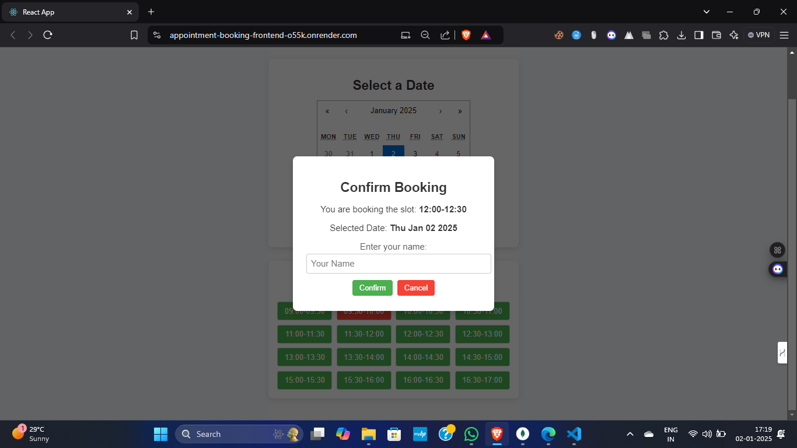

# Appointment Booking Application

## Overview

This is a simple appointment booking application that allows users to book 30-minute slots from Monday to Friday, 9:00 AM to 5:00 PM IST. The application ensures that users can only book appointments for a configurable number of days (default is 5 days) from today. Once a slot is booked, it becomes unavailable, and the UI handles scenarios where no slots are available with a clear message. 

Deployed live on **Render**, this application emphasizes usability, clarity, and efficient data handling.

---

## Live Demo

You can check out the live demo of the project here: <a href="https://calendar-communication-tracker-frontend.onrender.com/login" target="_blank">Live Demo</a>


## Features

- **Book Appointments:** Users can select a date and book 30-minute slots during working hours.
- **Dynamic Booking Window:** The number of days available for booking is configurable (default is 5 days).
- **Real-time Updates:** Once a slot is booked, it becomes unavailable immediately.
- **Responsive Design:** The application provides proper feedback for user actions and is focused on usability.

---

## Screenshots





## Technologies Used

- **Frontend:** React
- **Backend:** Node.js, Express
- **Database:** MongoDB
- **Deployment:** Render (Frontend and Backend)

---

## Setup and Deployment

### Prerequisites
- Node.js and npm installed
- MongoDB setup (local or cloud, e.g., MongoDB Atlas)

### Installation

1. Clone the repository:
   ```bash
   git clone https://github.com/Ayushjha298/appointment-booking.git

2. Install dependencies:
    For the backend:
      cd backend
      npm install
    For the frontend:
      cd frontend
      npm install

3. Set up environment variables:

    Backend: Create a .env file in the backend folder with

    MONGO_URI=<your-mongo-db-uri>

4. Run the application locally:

    Start the backend:
    cd backend
    npm run dev

    Start the frontend:
    cd frontend
    npm start

Deployment

Deployed on Render:

Frontend: [Frontend URL](https://appointment-booking-frontend-o55k.onrender.com/)
Backend: [Backend URL](https://appointment-booking-backend-sljd.onrender.com/api)

    

## Contact

For any questions or feedback, please reach out to [ayushjha298@gmail.com](mailto:ayushjha298@gmail.com).
